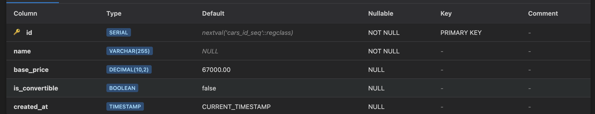

# 🚗 Bolt Bucket — DIY Delight

<div align="center">

**Premium Car Customization Platform**

A full-stack web application that brings automotive personalization to life with real-time visual previews and intelligent option validation.


[Live Demo](#) · [Report Bug](#) · [Request Feature](#)

</div>

---

## 📋 Table of Contents

- [Overview](#-overview)
- [Features](#-features)
- [Tech Stack](#-tech-stack)
- [Getting Started](#-getting-started)
- [Project Structure](#-project-structure)
- [API Documentation](#-api-documentation)
- [Database Setup](#-database-setup)
- [Verification](#-verification)
- [Screenshots](#-screenshots)
- [Roadmap](#-roadmap)
- [Contributing](#-contributing)

---

## 🎯 Overview

Bolt Bucket is a modern, full-stack car customization platform that empowers users to design their dream vehicle. Built with React and Express, it features real-time visual previews, dynamic pricing calculations, and robust server-side validation to ensure configuration integrity.

**Built for:** CodePath WEB103 - Week 5 Assignment  
**Purpose:** Demonstrating full-stack development with React, Express, and PostgreSQL

---

## ✨ Features

### Core Functionality

✅ **Real-Time Customization** - Live visual preview updates as you select options  
✅ **Dynamic Pricing** - Automatic price calculation based on selected features  
✅ **Persistent Storage** - Save, edit, and delete custom configurations  
✅ **Smart Validation** - Server-side logic prevents incompatible option combinations  
✅ **Responsive Design** - Seamless experience across desktop and mobile devices

### Technical Highlights

🔹 **RESTful API** - Clean Express endpoints for CRUD operations  
🔹 **PostgreSQL Database** - Relational data model with foreign keys  
🔹 **React Router** - Client-side routing with dynamic pages  
🔹 **Axios Integration** - Centralized API service layer  
🔹 **Client-Side Validation** - Pre-submission compatibility checks  

---

## 🛠 Tech Stack

### Frontend
- **React 18.3** - UI component library
- **Vite 5.4** - Lightning-fast build tool
- **Tailwind CSS 3.4** - Utility-first styling
- **React Router 6.28** - Declarative routing
- **Axios 1.7** - HTTP client

### Backend
- **Node.js** - Runtime environment
- **Express 4.21** - Web application framework
- **PostgreSQL 16+** - Relational database
- **pg 8.13** - PostgreSQL client for Node.js
- **dotenv 16.4** - Environment variable management

---

## 🚀 Getting Started

### Prerequisites

```bash
node >= 18.0.0
npm >= 9.0.0
postgresql >= 16.0
```

### Installation

1️⃣ **Clone the repository**
```bash
git clone https://github.com/yourusername/bolt-bucket.git
cd bolt-bucket
```

2️⃣ **Install server dependencies**
```bash
cd server
npm install
```

3️⃣ **Install client dependencies**
```bash
cd ../client
npm install
```

### Configuration

4️⃣ **Set up environment variables**

Create `server/.env` based on `server/.env.example`:

```env
# PostgreSQL Configuration (Render)
PGHOST=your-render-host.render.com
PGPORT=5432
PGUSER=your_database_user
PGPASSWORD=your_secure_password
PGDATABASE=bolt_bucket_db

# Server Configuration
PORT=4000
NODE_ENV=development
```

5️⃣ **Initialize the database**

```bash
cd server
node ./config/reset.js --run
```

**Expected output:**
```
🔄 Dropping existing tables...
✅ Tables dropped successfully
🏗️  Creating tables...
✅ Tables created successfully
🌱 Seeding options...
✅ Seeded 24 options across 4 categories
✨ Reset complete
```

### Running the Application

6️⃣ **Start the backend server**

```bash
cd server
npm start
# Server running on http://localhost:4000
```

7️⃣ **Start the frontend development server** (new terminal)

```bash
cd client
npm run dev
# Vite dev server running on http://localhost:5173
```

8️⃣ **Open your browser**

Navigate to `http://localhost:5173` and start customizing!

---

## 📁 Project Structure

```
bolt-bucket/
├── client/                    # React frontend
│   ├── src/
│   │   ├── components/       # Reusable UI components
│   │   ├── pages/           # Route-level pages
│   │   ├── services/        # API integration layer
│   │   └── utilities/       # Helper functions (price calc)
│   ├── assets/              # Images, GIFs, screenshots
│   └── index.html           # Entry point
│
├── server/                   # Express backend
│   ├── config/
│   │   └── reset.js         # Database initialization script
│   ├── controllers/         # Request handlers
│   ├── routes/              # API route definitions
│   ├── index.js             # Server entry point
│   └── .env.example         # Environment template
│
└── README.md                # You are here!
```

---

## 🔌 API Documentation

### Base URL
```
http://localhost:4000/api
```

### Endpoints

| Method | Endpoint | Description | Auth |
|--------|----------|-------------|------|
| `GET` | `/options` | Fetch all customization options | No |
| `GET` | `/options/:category` | Get options by category (EXTERIOR, ROOF, etc.) | No |
| `GET` | `/custom-items` | Retrieve all saved configurations | No |
| `GET` | `/custom-items/:id` | Get specific configuration by ID | No |
| `POST` | `/custom-items` | Create new custom configuration | No |
| `PUT` | `/custom-items/:id` | Update existing configuration | No |
| `DELETE` | `/custom-items/:id` | Remove saved configuration | No |

### Example Request

**Create a Custom Item:**
```bash
curl -X POST http://localhost:4000/api/custom-items \
  -H "Content-Type: application/json" \
  -d '{
    "name": "My Dream Car",
    "exterior_id": 1,
    "roof_id": 5,
    "wheels_id": 9,
    "interior_id": 13
  }'
```

**Response (201 Created):**
```json
{
  "id": 1,
  "name": "My Dream Car",
  "created_at": "2025-10-24T14:30:00.000Z",
  "total_price": 85000
}
```

### Validation Rules

The server enforces the following business logic:

- ❌ **Cannot combine** convertible roof with non-convertible exterior
- ❌ **Cannot combine** certain wheel sizes with specific exterior types
- ✅ **Valid combinations** pass through to database

**Example Error Response (400 Bad Request):**
```json
{
  "error": "Invalid option combination: convertible roof requires convertible exterior"
}
```

---

## 🗄 Database Setup

### Schema

**Options Table:**
```sql
CREATE TABLE options (
  id SERIAL PRIMARY KEY,
  name VARCHAR(100) NOT NULL,
  category VARCHAR(50) NOT NULL,
  price DECIMAL(10,2) NOT NULL,
  image_url TEXT
);
```

**Custom Items Table:**
```sql
CREATE TABLE custom_items (
  id SERIAL PRIMARY KEY,
  name VARCHAR(200) NOT NULL,
  exterior_id INTEGER REFERENCES options(id),
  roof_id INTEGER REFERENCES options(id),
  wheels_id INTEGER REFERENCES options(id),
  interior_id INTEGER REFERENCES options(id),
  created_at TIMESTAMP DEFAULT NOW()
);
```

### Connecting with TablePlus

1. Open TablePlus and create a new PostgreSQL connection
2. Fill in credentials from your `server/.env`:
   - **Host:** `PGHOST` value
   - **Port:** `5432`
   - **User:** `PGUSER` value
   - **Password:** `PGPASSWORD` value
   - **Database:** `PGDATABASE` value
3. Enable SSL/TLS (required for Render)
4. Test connection and explore your tables!

---

## ✅ Verification

### Quick Health Check

Test the API is running:

```bash
# Check server health
curl http://localhost:4000/api/options

# Expected: JSON array of 24 options
```

### Feature Checklist

#### Required Features (9/9 Complete)

- [x] React frontend displays API data
- [x] PostgreSQL database with proper schema
- [x] View customization options by category
- [x] Real-time visual preview updates
- [x] Dynamic total price calculation
- [x] Server-side validation for incompatible combos
- [x] Save custom configurations
- [x] View list of saved items
- [x] Edit and delete saved items

#### Stretch Features (1/1 Complete)

- [x] Client-side incompatibility prevention

---

## 📸 Screenshots

### Database Schema

*PostgreSQL tables showing relational structure with base_price = 67000*

### Application Walkthrough

*Full customization flow: select options → preview updates → save configuration*

---

## 🎯 Roadmap

### Phase 1: Testing & Quality (Next Sprint)
- [ ] Unit tests for price calculation utilities
- [ ] Integration tests for API endpoints (Jest + Supertest)
- [ ] E2E tests with Playwright
- [ ] GitHub Actions CI/CD pipeline

### Phase 2: UX Enhancements
- [ ] 3D car model rendering with Three.js
- [ ] Comparison tool (side-by-side configurations)
- [ ] Share configurations via unique URLs
- [ ] Export PDF summary of custom build

### Phase 3: Advanced Features
- [ ] User authentication (JWT)
- [ ] Saved favorites and wish lists
- [ ] Price alerts for option discounts
- [ ] Admin panel for managing options

---

## 🤝 Contributing

Contributions, issues, and feature requests are welcome!

1. Fork the repository
2. Create your feature branch (`git checkout -b feature/AmazingFeature`)
3. Commit your changes (`git commit -m 'Add some AmazingFeature'`)
4. Push to the branch (`git push origin feature/AmazingFeature`)
5. Open a Pull Request

---

## 📝 License

This project is built for educational purposes as part of CodePath's WEB103 course.

---

## 👤 Author

**Your Name**
- GitHub: [@jellyfishing2346](https://github.com/jellyfishing2346)
- LinkedIn: [Faizan Khan](https://linkedin.com/in/faizan-khan34)

---

## 🙏 Acknowledgments

- CodePath WEB103 curriculum and instructors
- [Render](https://render.com) for PostgreSQL hosting
- [Tailwind CSS](https://tailwindcss.com) for styling utilities
- [Vite](https://vitejs.dev) for blazing-fast development experience

---

<div align="center">

**⭐ If you found this project helpful, please consider giving it a star!**

Made with ❤️ for CodePath WEB103

</div>